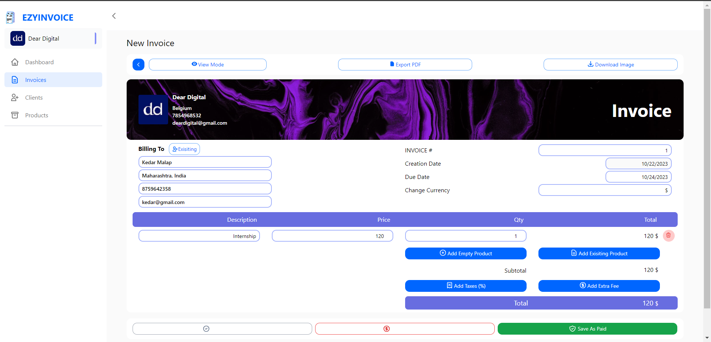
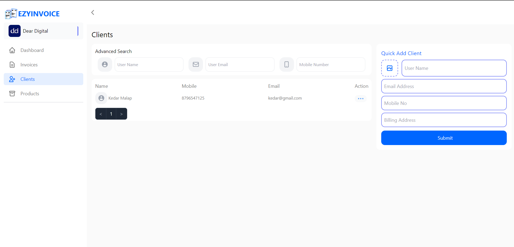
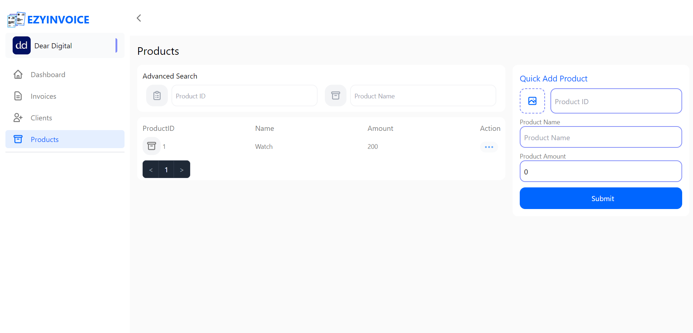
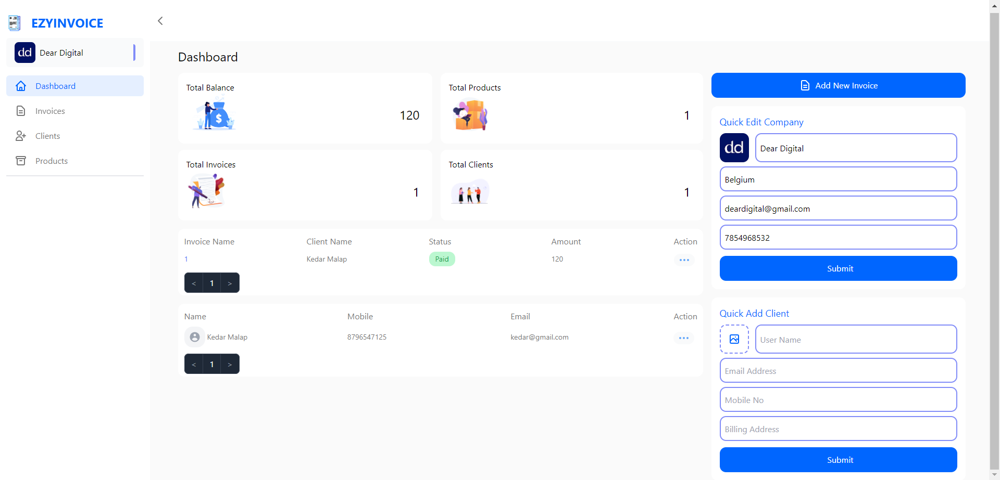
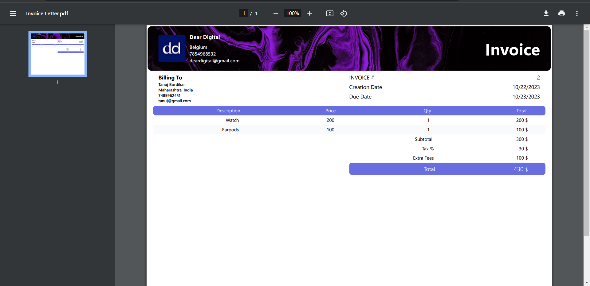
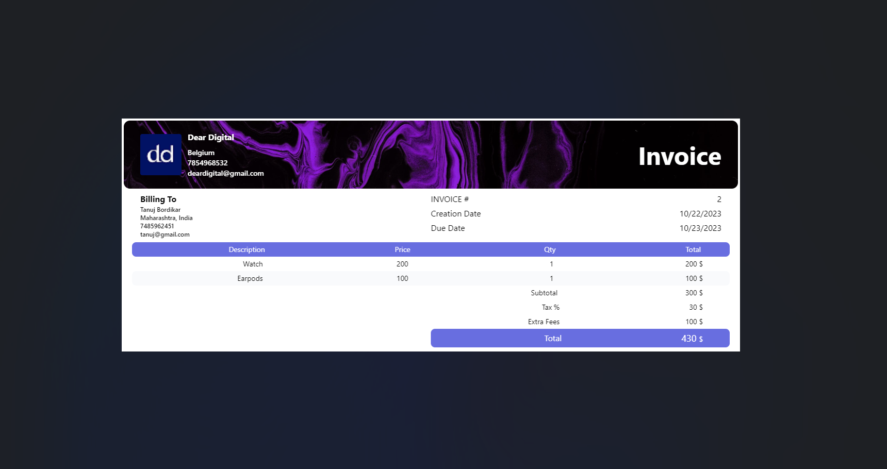
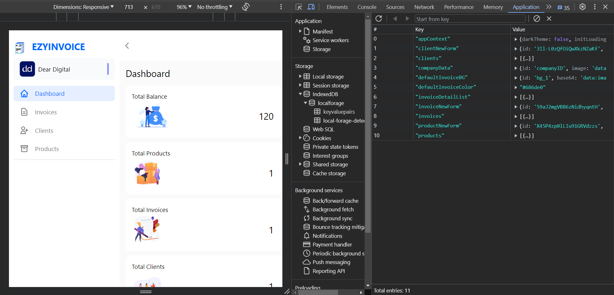

# Comprehensive Invoice Generator App (EZYINVOICE)

#### Deployed on Vercel [Click Here](https://invoice-generator-ten-iota.vercel.app/)

#### GitHub Repository Link [Click Here](https://github.com/kmalap05/invoice-generator/tree/invoice-generator)

### Features of the Project

- Used local storage, so the invoices and companies detials can be saved everytime.
- Can download invoice in PDF format.
- Can download invoice in Image format.
- Also we can have as many client we want and save them so that next time we want to generate a invoice for them we can directly add the client.
- Also we can list down multiple products so it will save time when adding in invoice.
- An intuitive dashboard where you can see all the details on one page.

### Screenshots

- **Invoice Dashboard**

##### Some Design Issues:

1. The text on red button (Save as Unpaid) is not visible which is on the left of green button.
2. The text on grey button (Save as Draft) is not visible which is on the left of red buttion.

---

- **Quick Add Client**

---

- **Add Products**

---

- **User Dashboard**

---

- **Downloaded Invoice PDF**

---

- **Downloaded Invoice Image**

---

- **Data Stored In Local Storage**

---
